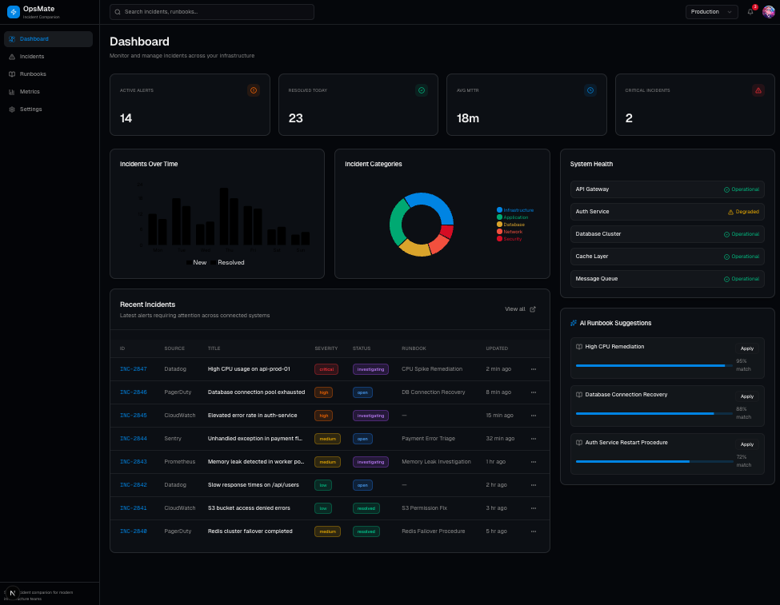
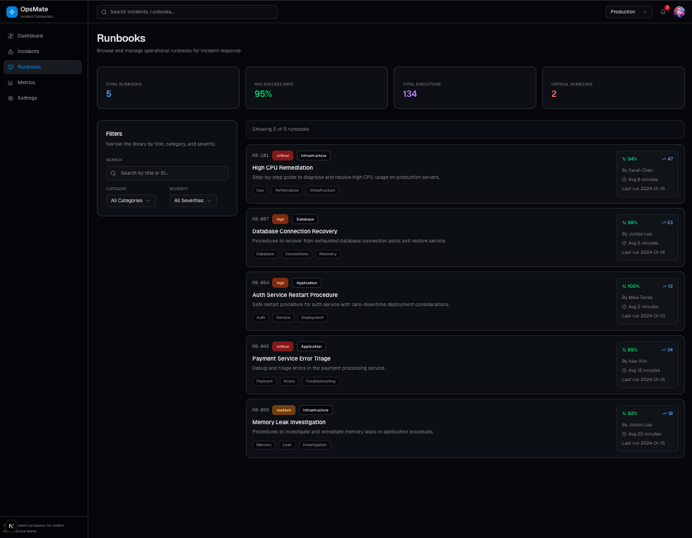
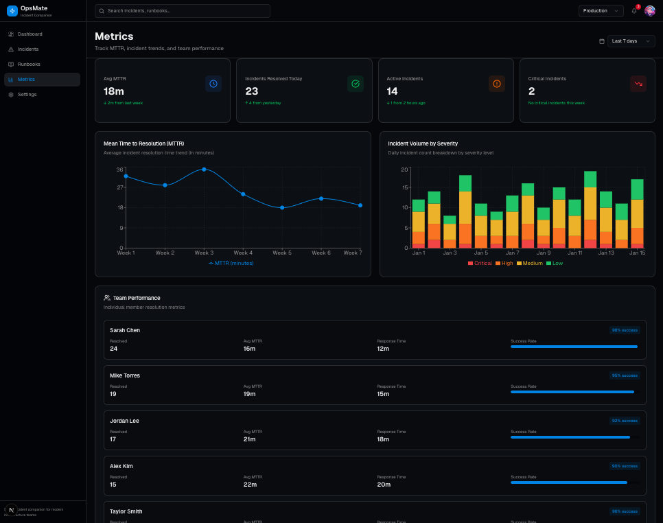

# OpsMate

OpsMate is a full-stack incident operations app for infrastructure teams. It combines incident visibility, runbook access, and incident-derived analytics in a single Next.js service with built-in API routes and SQLite persistence.

https://opsmate-production.up.railway.app/

## Screenshots

### Dashboard



### Runbooks



### Metrics



## What It Is

OpsMate helps teams:

- track active and resolved incidents
- inspect incident details and operational context
- browse runbooks tied to common failure modes
- view dashboard and metrics pages backed by incident data

## Why It Matters

Operational tools are most useful when they are fast to understand and realistic to run. OpsMate is intentionally built as a practical single-service system that is easy to run locally, easy to deploy, and honest about its current trade-offs.

## Tech Stack

- Next.js App Router
- React + TypeScript
- Tailwind CSS
- shadcn/ui
- Recharts
- Next.js API routes for backend slices
- SQLite via `better-sqlite3`
- Docker and Docker Compose
- Railway for the current deployment model
- GitHub Actions CI

## Architecture

OpsMate currently runs as one full-stack web service.

- frontend UI lives in `apps/web`
- backend endpoints live in `apps/web/app/api`
- incidents and runbooks persist to SQLite
- dashboard and metrics pages derive analytics from persisted incident timestamps
- the public app uses same-origin `/api` requests by default

Repository shape:

```text
.
├── apps/
│   └── web/
│       ├── app/
│       ├── components/
│       ├── lib/
│       ├── Dockerfile
│       └── .env.example
├── docker-compose.yml
├── railway.json
└── .env.example
```

## Local Setup

Run the app directly from the Next.js workspace:

```bash
cd apps/web
npm install
cp .env.example .env.local
npm run dev
```

The app will be available at [http://localhost:3000](http://localhost:3000).

## Docker / Compose

For a production-style local run from the repo root:

```bash
cp .env.example .env
docker compose up --build
```

This starts the single web service on `http://localhost:${WEB_PORT:-3000}` and mounts a named Docker volume for SQLite data.

## SQLite Persistence

OpsMate uses SQLite because the current architecture is a single service with modest persistence needs.

- local app default: `apps/web/data/opsmate.db`
- compose default: `/app/data/opsmate.db`
- Railway volume path: `/data/opsmate.db`

Relevant environment variables:

- `SQLITE_DB_PATH`: SQLite database file path
- `NEXT_PUBLIC_API_BASE_URL`: optional external API origin; leave unset to use same-origin `/api`
- `WEB_PORT`: published host port for Docker Compose

See `apps/web/.env.example` and `.env.example` for working examples.

## Health Endpoint

The app exposes a lightweight health endpoint for runtime checks:

```text
GET /api/health
```

It returns `200 OK` when the app is up and SQLite is reachable.

## Deployment Model

The current deployment model is intentionally simple and honest:

- one Railway web service
- one attached persistent volume
- one running instance

`railway.json` points Railway at `apps/web/Dockerfile` and configures the `/api/health` healthcheck.

This is a good fit for the current SQLite-backed architecture. If OpsMate later needs horizontal scaling or multi-writer persistence, the right next step is moving to a managed database rather than stretching the current SQLite deployment model.
